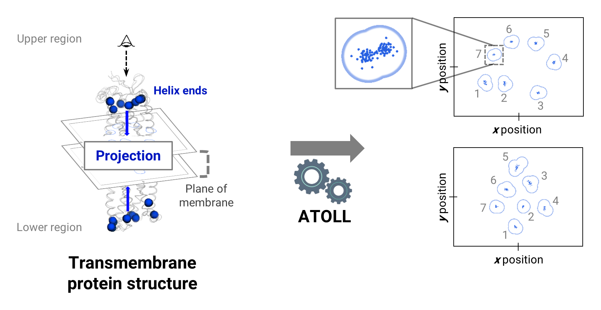

# ATOLL
Visualization tool for transmembrane protein structures. Visit the [atoll.drugdesign.unistra.fr](https://atoll.drugdesign.unistra.fr) website to run ATOLL using a GUI.

 

## Description
ATOLL (Aligned Transmembrane dOmain Layout fLattening) is a program for visualizing 3D structures of the transmembrane helix bundle of membrane proteins. ATOLL projects portions of helices onto the plane of the membrane, as if looking at the protein from above the membrane. It allows the comparison of different conformations of the same protein or of different proteins. ATOLL principle and examples of applications are described in an application note submitted to Bioinformatics.

## Requirements
ATOLL is written in Python 3 and requires the NumPy, SciPy, Matplotlib, PyYAML, Biopython and MDAnalysis modules. It is strongly recommended to create an Anaconda environment using the *conda3.yaml* file provided. The program is compatible with Windows, Mac OS and Linux operating systems.

## How ATOLL works
### Input files
To launch ATOLL, several files must be provided:
- structure(s) to be analysed
- reference structure
- sequence alignment file
- annotation file

#### Structure file(s)
The structure(s) that will be analysed by ATOLL are provided in one or several structure files. Each structure file contain one or more structures. It is possible to compare different proteins represented each by multiple structures (e.g., comparison of the molecular dynamics (MD) trajectories of two proteins). The file can contain, in addition to the proteins to be studied, other types of molecule (solvent, lipids, etc...). However, it is recommended to remove all non-essential objects from the file, to avoid increasing input reading time, especially in the case of molecular dynamics (MD) trajectories. 

**Warning**: If a protein is an oligomer (several chains), it must be described as a single chain with an incremental numbering of the residues. You can use the "sanitize" routine to process your structure.

```bash
python sanitize bin/atoll.py --structure <structure_file_to_process> --output <the_processed_structure_file>
```

The supported file formats and corresponding extensions are :
- *Static*
    - Protein Data Bank (PDB): .pdb
    - SYBYL (MOL2): .mol2
- *Multiple*
    - Topology
        - AMBER TOP: .prmtop, .top, parm7
        - CHARMM PSF: .psf
        - Protein Data Bank (PDB): .topdb
    - Coordinate
        - AMBER CRD: .inpcrd
        - AMBER RST: .inprst
        - AMBER TRJ: .trj
        - AMBER NetCDF: .ncdf, .nc
        - CHARMM DCD: .dcd
        - GROMACS XTC: .xtc
        - GROMACS TRR: .trr

*Static* format refers to structure file usually containing a single structure (PDB or MOL2), while *multiple* format refers to MD trajectories (CRD, RST, NC, DCD, ...). 

For molecular dynamics trajectories, the topology file and coordinate file(s) of each protein must be placed in a dedicated directory. ATOLL scans the directory to find the topology and coordinate files from their extension.

Depending on the *static* or *multiple* nature of the file, ATOLL uses different representations (see publication).

*Important* : If the structure files contain proteins which differ in their sequence and / or in the numbering of residues, a sequence alignment file must be provided too (see 'Sequence alignment file' below).

#### Reference file
The reference structure defines the correct orientation of the protein in the membrane, which is *XY* plane.

There are three ways of preparing the reference structure in the appropriate coordinate frame: using with your favorite software for protein display and edition; using ATOLL webserver (https://atoll.drugdesign.unistra.fr); or downloading a structure from the structural database of orientations of proteins in membrane [OPM](https://opm.phar.umich.edu/).
Note that if there are several structures in the reference file, ATOLL only takes into account the first one, the following ones being ignored. The supported file formats are those of *static* structures.

The reference structure is also used to define the projected TMs. If the reference structure is different from the input proteins, its sequence must be given in the alignment file (see 'Sequence alignment file' below).

All the input structures must be superimposed onto the TMs of the reference structure. 

#### Sequence alignment file
A multiple sequence alignement is requiered if the protein sequence is not strictly conserved between the reference and all the entries, i.e., if there are differences in the sequence length and composition (e.g., missing residues), or if residue numbering is inconsistent.

The stockholm file format (.sto or .stk) is the only supported format.
Format developed by E Sonnhammers (https://sonnhammer.sbc.su.se/Stockholm.html)

ATOLL requieres the following features and tags: 

- #GF SG <number>               : number of sequences in alignment
- #GS <seqname> RE reference    : definition of the reference

Example: 4 sequences aligned, the third one (P2X7_RAT/1-60) is the reference        

```
# STOCKHOLM 1.0
#=GF SQ 4
#=GS P2X7_RAT/1-60 RE reference
P2X4_ZEBRAFISH/1-40       --------------------GSSKKVGTLNRFTQALVIAYVIGYVFVYNKGYQDTDTVL-S
amP2X_GULFCOASTTICK/1-43  -----------------GSREFDQKIGVLNRLIQLLILGYIIGYVIIYQKGYQQFSTFN-A
P2X7_RAT/1-60             MPACCSWNDVFQYETNKVTRIQSVNYGTIKWILHMTVFSY-VSFALMSDKLYQRKEPLI-S
P2X3_HUMAN/1-57           ----GSRADFFTYETPKVIVVKSWTIGIINRVVQLLIISYFVGWVFLHEKAYQVRDTAIES
```

#### Annotation file
The annotation file is mandantory. It defines ATOLL parameters. Data is formatted as a table in CSV (comma separator) or TSV (tab separator) format, and comprising 6 fields:
- "Entry": unique label for each entry.
- "Sequence name": associated label in the sequence alignment file.
- "Group": define a group for several entries.
- "Type": specifies whether it is a *static* or *multiple* entry.
- "Path": path of the entry. Must be a file if the entry is *static* and a directory if the entry is *multiple*.
- "Color": entry color when generating the images. For a full list of colors see the following [link](https://matplotlib.org/stable/gallery/color/named_colors.html) 

Each *static* structure and each directory with *multiple* structures is considered as an entry.

### Running ATOLL
The program is launched via a terminal. Here is an example from tutorial 02:

```bash
python atoll ../../bin/atoll.py -ref 4lde_clean.pdb -seq sequences.sto -out results -rn position -inf info.tsv -ra 16-31+51-67+86-103+132-148+177-194+255-269+289-302 -rh 10-38+46-74+82-113+126-147+175-203+246-276+284-302 --overwrite
```

In detail, the different options are :
- ```-ref```: path of the reference structure.
- ```-seq```: path of the sequence alignment file.
- ```-inf```: path of the annotation file.
- ```-out```: path of the directory where outputs will be stored.
- ```-ra```: residues used during structural alignment.
- ```-rh```: definition of the transmembrane helices to be projected.
- ```-rn```: how the residues provided in ```-ra``` and ```-rh``` are interpreted. The allowed values are "position" which corresponds to the position of the residues in the sequence alignment file or in the reference structure, and "resid" which corresponds to the residue number.
- ```--overwrite```: If the output directory exists, it will be overwritten.

NB: The residue synthax in ```-ra``` and ```-rh``` allows to define a range with the character '-' and to separate the ranges with the character '+'.
 
## FUNDING
This work was supported by the Agence Nationale de Recherches sur le Sida [AO 2016-2 CSS2 17252 to E.K, PhD grant to C.J.]; and the Laboratoire d’Excellence Medalis de Agence Nationale de la Recherche [ANR_10-LABX-0034 to EK].

